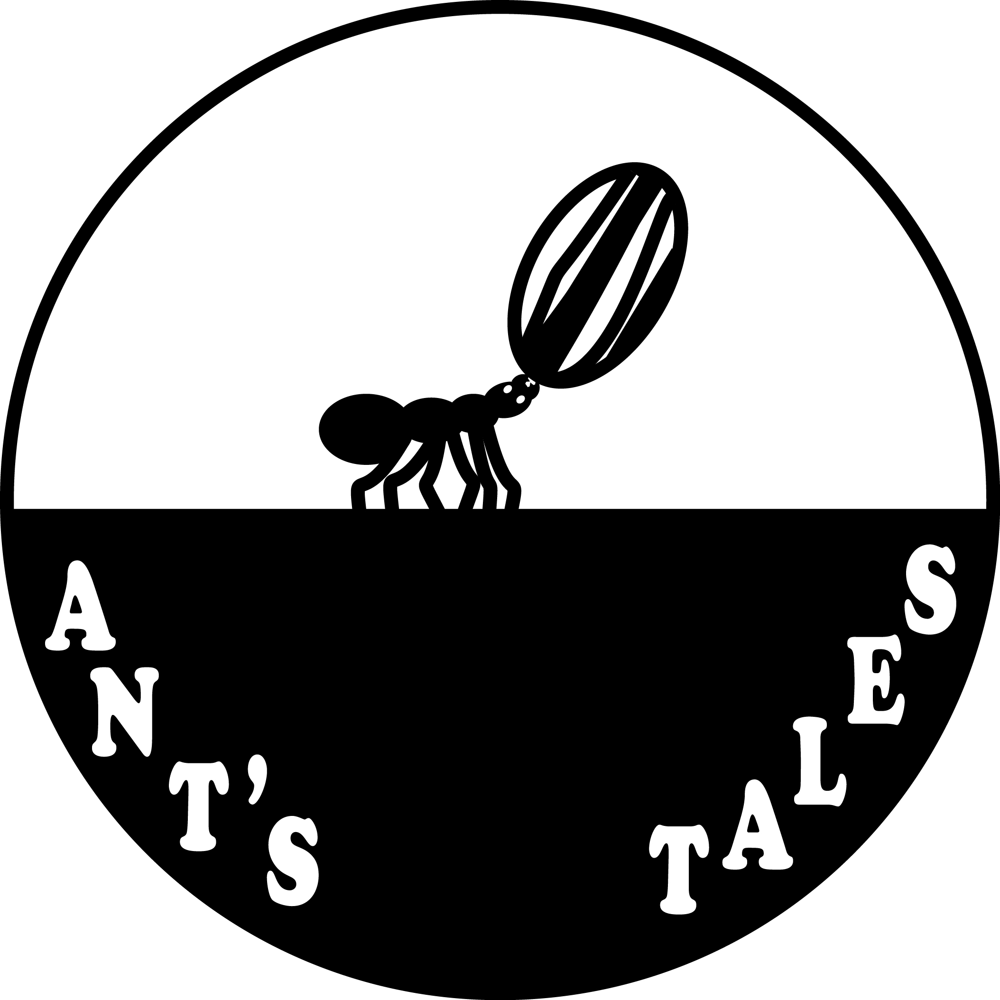
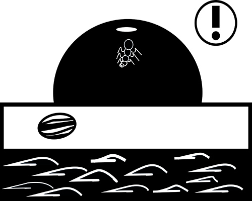
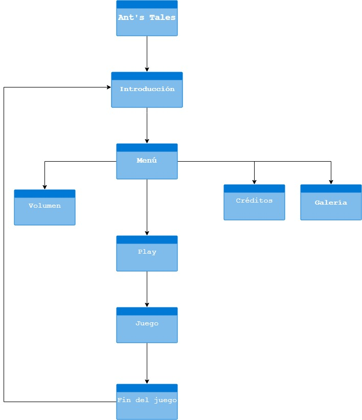

## Ant's tales

Proyecto de Creación Multimedia Interactiva de la  Facultad de Bellas Artes de la Univesidad de Granada

# 1 Datos 

**Titulo** : Ant's tales

**Web:**  https://github.com/Cristinaluque/Cristinaluque.github.io

**Autor:**  Cristina Luque Santaella

**Resumen** : Este proyecto trata sobre las aventuras de una pequeña hormiga que quiere conseguir una pipa que encontró cerca de su hogar pero antes de conseguirla se topará con obstáculos que dificultarán esta misión.

**Estilo/género:**  Novela / Juego / Aventuras / Plataformas

**Logotipo** :  Este logotipo representa todo el concepto del juego en una única imagen.

**Resolución:** 800x600px responsivo/o tamaño fijo.

**Probado en:**   Probado en Mozilla Firefox y Google Chrome.

**Tamaño proyecto:** 22.38 MB 

**Licencia**  Este obra está bajo una <a rel="license" href="http://creativecommons.org/licenses/by-nc-nd/3.0/es/">licencia de Creative Commons Reconocimiento-NoComercial-SinObraDerivada 3.0 España</a>.

**Fecha** : 15/06/2020

**Medios** :

- Github: https://github.com/Cristinaluque/Cristinaluque.github.io

# 2. Memoria del proyecto 

### 2.1 Storyboard: 

Mi proyecto comienza con la aparición de una pipa que cae de un girasol y rodando llega hasta un hormiguero donde nuestra protagonista 
comenzará su aventura para conseguirla. La pipa es arrastrada por el rio antes de que la hormiga pueda atraparla y es por esto que decide ir en su búsqueda, siguiendo el rio se topa con su primer obstáculo que es un ciervo volante que quiere quedarse con la pipa ya que esta a llegado a sus dominios, al ver que la situación no llevaba a ningún lado el ciervo decide atacar a la hormiga y cansado de no ver resultados lanza la pipa a lo profundo del bosque. La hormiga decide seguir con la misión principal y durante la caminata aparece ante ella una mantis, que dice ser la reina del bosque, esta se interpone en el camino de la hormiga porque dice que la hormiga es la culpable de la desaparición tanto de sus guardias como de la misma pipa que estaban custodiando, la mantis vengativa decide atacar a la hormiga pero al no ver resultados prefiere abandonar la pelea.

Nuestra protagonista después de todo el camino que lleva recorrido decide avanzar ya que no perdería nada sin avanzase un poco más hasta que escucha unos gritos de socorro cerca de donde se encuentra y decide ir a investigar el origen de los gritos, llega a la conclusión de que provienen de la copa de un árbol por lo tanto sube por él. Una gran araña tiene retenidos a tres insectos junto a la pipa que ella andaba buscando, esta araña había creado una trampa para la hormiga unicamente para entretenerse y como no estaba dispuesta a que la hormiga se escapase decide pelear para poder atraparla. Lo que no se esparaba la araña es que con sus saltos provocará la rotura de la tela y la salvación de los insectos a su vez de la pipa, una vez en tierra los insectos que eran los guardias de la reina mantis agradecieron a la hormiga y prometieron a la hormiga que la imagen que tenían de ella en el bosque sería restaurada y ellos mismos hablarían con la reina para que así fuera. 
El juego acaba con la hormiga que al fin a conseguido su pipa y hay un atardecer que remarca el final de esta aventura.

### 2.2. Esquema de navegación 

# 3. Metodología

Metodología de desarrollo de productos multimedia basado en una metodología de UX (User Experience)

### Etapa 1: Ideación de proyecto

**Investigación de campo**

- Creadores de contenido inspirador[Samorost]: (https://amanita-design.net/) 
- Compañias de videojuegos que inspiran: (https://www.naughtydog.com/) (https://thatgamecompany.com/#) (https://www.quanticdream.com/en)

**Motivación de la propuesta** 

Este  proyecto es interesante porque yo quería llevar el mundo animal a los videojuegos y más concretamente los insectos porque yo no conozco ningún videojuego que trate sobre insectos, pero si que conozco películas cuyos protagonistas son insectos algunos ejemplos como Antz o también la película Bichos: Una aventura en miniatura e incluso películas y libros sobre seres diminutos que viven en el bosque pero no conocía ningún videojuego, es por esto que decidí arriesgarme y hacer algo fuera de lo común teniendo como referencia a los propios insectos y la naturaleza.

**Publico / audiencia**

- Orientado todo los públicos, en un inicio este juego estaba destinado a un público infantil es decir a menores de 12 años pero con su desarrollo posterior pensé que cualquier persona podría jugarlo. 

### Etapa 2: Desarrollo / actividades realizadas

(qué soluciones has planteado y cómo se han resuelto: juego, galería de fotos, grabación de video, etc.)

- **Juego:** Este es un juego de plataformas y aventuras inspirado en juegos de click and point con una única meta final y sin finales alternativos.

- **Video:** Todos los videos que contiene el juego fueron colocados para aportar mayor diversión al jugador y a su vez para que la visualización del juego fuera dinámica y de esta manera a mi como creadora se me permitiera también experimentar con las posibilidades de un video en movimiento dentro de un videojuego.

- **Instrucciones y ayuda al usuario:**  

1.- En la escena de batallas la hormiga tiene movimiento propio.

2.- La mayoría de los escenarios son videos en movimiento para activarlos hay que hacer click encima de ellos.

3.- Para pasar los diálogos y avanzar en general se debe pulsar la barra espaciadora.

4.- Este juego deberá ser abierto con el servidor de Chrome para una visualización optima.

- **Menús y elementos de navegación:** Para interactuar en el juego se usa la barra espaciadora y el ratón del ordenador.

### Etapa 3: Problemas identificados

Problemas que yo he podido identificar se corresponden con la segunda práctica ya que al subirla a Github el juego daba saltos entre escenas y se saltaba tanto escenas como diálogos además de la imposibilidad de visionar los videos. Otra cosa importante es que tú como jugador no comienzas desde el inicio del juego si hablamos de la segunda práctica sino que se salta el juego para comenzar por la mitad de la historia.

### 3.1 Quiz: 

Este proyecto surge con la idea de crear una serie de preguntas que tuvieran relación con el videojuego principal y que sirviesen para conocer de una manera más divertida algunas cualidades que probablemente no sabías que podían tener los insectos. Este juego se compone de 10 preguntas con tres opciones posibles para elegir (A, B, C) y de esta forma obtener una puntuación sobre 10 sobre tu conocimiento acerca de estos insectos. Puedes volver a jugar las veces que quieras y otra opción podría ser ver las respuestas finales que también es posible además de te ayudara expadir tus conocimientos sobre ellos.

# 4. Conclusiones 

Desde mi punto de vista la creación de un juego en la situación de confinamiento ha supuesto todo un reto porque al mínimo error que tus ojos no perciban esto  hace que todo el trabajo no se desarrolle como tu deseabas, en mi caso respecto a la colocación de videos he aprendido que primero debo de estar segura de si una plataforma externa va a poder reproducirlos correctamente, ahora se que debo de realizar pruebas con anterioridad para todo el contenido que vaya a subir a internet ya sean videos, imágenes, páginas web, etc.
Otra cosa que he aprendido y que aplicaré en un futuro es que aunque el contenido en un inicio se desarrolle perfecto al reproducirlo en tu ordenador desde otros ordenadores y desde otras plataformas puede no verse igual.

# 5 Referencias 

**Artículos y blogs** 

- Insectos que son los protagonistas de historias: (https://enfilme.com/notas-del-dia/video-el-uso-de-insectos-en-los-filmes-de-animacion-de-ladislas-starevich) 
(https://www.fotogramas.es/noticias-cine/g22722538/peliculas-infantiles-insectos/)

- Entrevista interesante: (https://www.indieorama.com/samorost/)

**Recursos y materiales audiovisuales:**

* Música: Estas son las páginas webs de las que he conseguido la música de este juego (https://audionautix.com/) (https://freemusicarchive.org/static) 
* Imágenes y videos: Todos los videos e imágenes vienen de esta página web (https://pixabay.com/es/)
* Tipografía: (https://www.dafont.com/es/triforce.font), (https://fontzone.net/font-details/oratorstd)

**Herramientas utilizadas**

- Hippani Animator 5.1
- Adobe Photoshop
- Adobe Illustrator

 Este obra está bajo una <a rel="license" href="http://creativecommons.org/licenses/by-nc-nd/3.0/es/">licencia de Creative Commons Reconocimiento-NoComercial-SinObraDerivada 3.0 España</a>.

Mayo 2020
