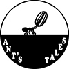

## Ant's tales

Proyecto de Creación Multimedia Interactiva de la  Facultad de Bellas Artes de la Univesidad de Granada

# 1 Datos 

**Titulo** : Ant's tales

**Web:**  https://github.com/Cristinaluque/Cristinaluque.github.io

**Autor:**  Cristina Luque Santaella

**Resumen** : Este proyecto trata sobre las aventuras de una pequeña hormiga que quiere conseguir una pipa que encontró cerca de su hogar pero antes de conseguirla se topará con obstáculos que dificultarán esta misión.

**Estilo/género:**  Novela / Juego / Aventuras / Plataformas

**Logotipo** :  Este logotipo representa todo el concepto del juego en una única imagen.

**Resolución:** 800x600px responsivo/o tamaño fijo.

**Probado en:**   Probado en Mozilla Firefox y Google Chrome.

**Tamaño proyecto:** 22.38 MB 

**Licencia**  Este obra está bajo una <a rel="license" href="http://creativecommons.org/licenses/by-nc-nd/3.0/es/">licencia de Creative Commons Reconocimiento-NoComercial-SinObraDerivada 3.0 España</a>.

**Fecha** : 15/06/2020

**Medios** :

- Github: https://github.com/Cristinaluque/Cristinaluque.github.io

# 2. Memoria del proyecto 

### 2.1 Storyboard: 

Mi proyecto comienza con la aparición de una pipa que cae de un girasol y rodando llega hasta un hormiguero donde nuestra protagonista 
comenzará su aventura para conseguirla. La pipa es arrastrada por el rio antes de que la hormiga pueda atraparla y es por esto que decide ir en su búsqueda, siguiendo el rio se topa con su primer obstáculo que es un ciervo volante que quiere quedarse con la pipa ya que esta a llegado a sus dominios, al ver que la situación no llevaba a ningún lado el ciervo decide atacar a la hormiga y cansado de no ver resultados lanza la pipa a lo profundo del bosque. La hormiga decide seguir con la misión principal y durante la caminata aparece ante ella una mantis, que dice ser la reina del bosque, esta se interpone en el camino de la hormiga porque dice que la hormiga es la culpable de la desaparición tanto de sus guardias como de la misma pipa que estaban custodiando, la mantis vengativa decide atacar a la hormiga pero al no ver resultados prefiere abandonar la pelea.

Nuestra protagonista después de todo el camino que lleva recorrido decide avanzar ya que no perdería nada sin avanzase un poco más hasta que escucha unos gritos de socorro cerca de donde se encuentra y decide ir a investigar el origen de los gritos, llega a la conclusión de que provienen de la copa de un árbol por lo tanto sube por él. Una gran araña tiene retenidos a tres insectos junto a la pipa que ella andaba buscando, esta araña había creado una trampa para la hormiga unicamente para entretenerse y como no estaba dispuesta a que la hormiga se escapase decide pelear para poder atraparla. Lo que no se esparaba la araña es que con sus saltos provocará la rotura de la tela y la salvación de los insectos a su vez de la pipa, una vez en tierra los insectos que eran los guardias de la reina mantis agradecieron a la hormiga y prometieron a la hormiga que la imagen que tenían de ella en el bosque sería restaurada y ellos mismos hablarían con la reina para que así fuera. 
El juego acaba con la hormiga que al fin a conseguido su pipa y hay un atardecer que remarca el final de esta aventura.

### 2.2. Esquema de navegación 

# 3. Metodología

Metodología de desarrollo de productos multimedia basado en una metodología de UX (User Experience)

### Etapa 1: Ideación de proyecto

**Investigación de campo** (propuestas inspiradoras para el proyecto)

- Portfolio [Leonardi Web page](http://www.rleonardi.com/interactive-resume/) para idear cómo organizar el material
- 

**Motivación de la propuesta** 

Este  proyecto es interesante porque ... 

**Publico / audiencia**

- Orientado todo los públicos.

### Etapa 2: Desarrollo / actividades realizadas

(qué soluciones has planteado y cómo se han resuelto: juego, galería de fotos, grabación de video, etc.)

- Juego. 
- Video 
- Instrucciones y ayuda al usuario 
- Menús y elementos de navegación (botones)
- etc.

### Etapa 3: Problemas identificados

(que consideras que no  funciona correctamente y por qué )

# 4. Conclusiones 

(explica brevemente tu valoración, problemas que has detectado y que te gustaría hacer o mejorar en el futuro )

# 5 Referencias 

**Artículos y blogs ** 

- Crofts, S., Fox, M., Retsema, A. and Williams, B. (2005) *Podcasting: A new technology in search of viable business models*First Monday, 10(9). https://doi.org/10.5210/fm.v10i9.1273. Recuperado el 8 de abril de 2020 de: https://journals.uic.edu/ojs/index.php/fm/article/view/1273/1193

**Recursos y materiales audiovisuales:**

* Musica:  
* Imágenes:  
* Tipografía

**Herramientas utilizadas**

- Hippani Animator 5.1
- 

(imagen de la licencia, copiar y pegar aquí la correcta)

https://creativecommons.org/licenses/?lang=es

Mayo 2020
